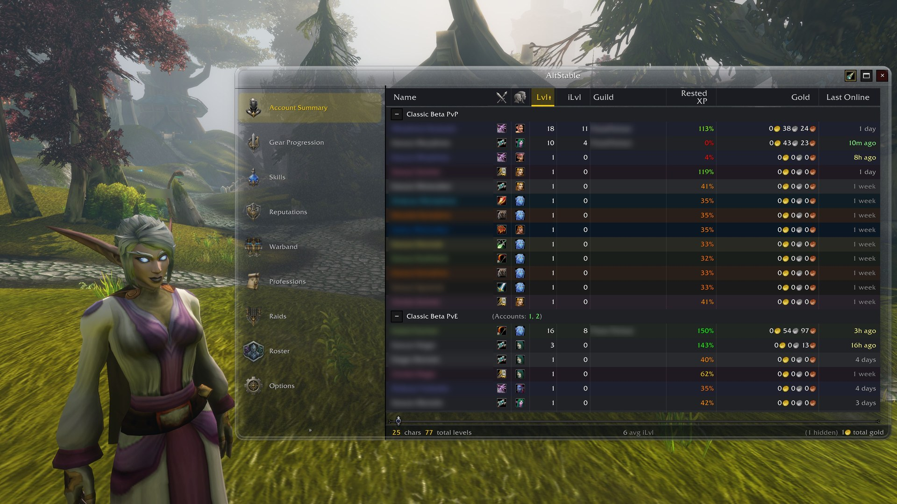
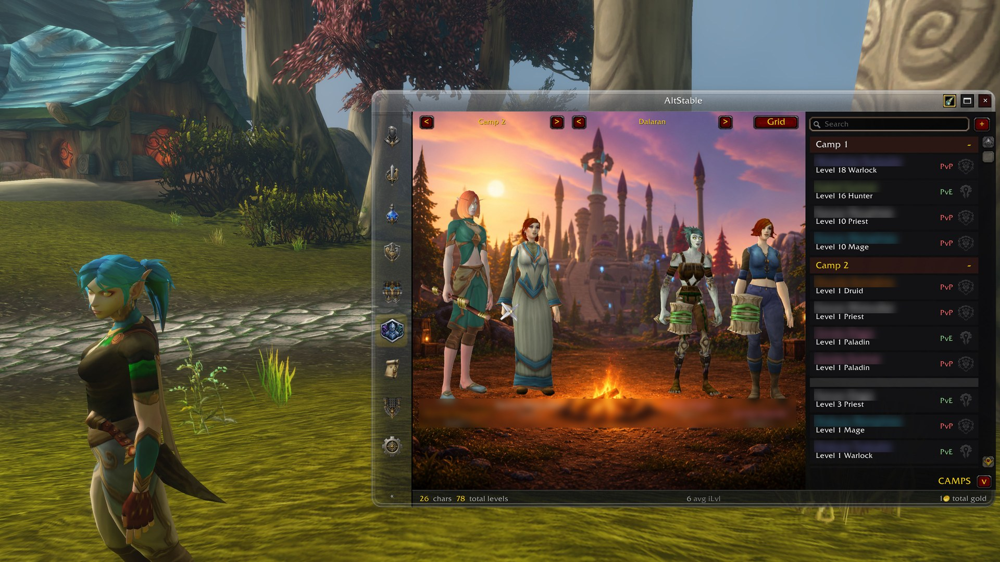
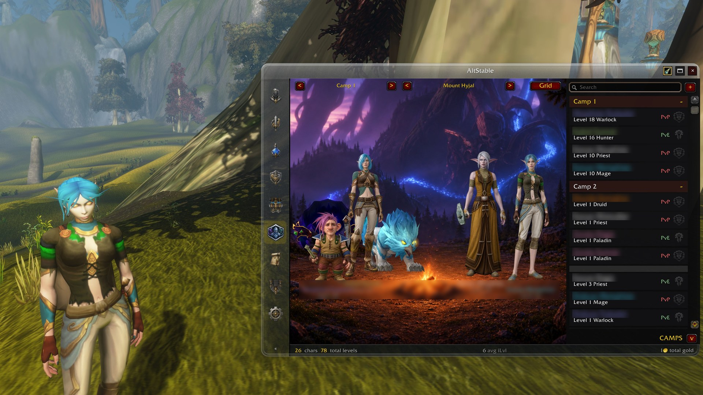

# AltStable — Forever Edition

All your characters in one window, for **World of Warcraft: Forever**. You can see their
gear, professions and recipes, reputations, gold, rested XP, raid lockouts, and what's in
their bags and banks. You can also stand them together as a roster.

## Three pieces, and only the first is required

| Piece | What it is | Do you need it? |
|---|---|---|
| **AltStable** (this addon) | Tracks and compares your characters in the game | Yes. It is complete on its own |
| **[AltStable Companion](https://github.com/Spotnick2/AltStableCompanion/releases)** | A free Windows app that turns your portrait captures into the Roster's character portraits | Only for portraits in the Roster |
| **Enhanced portraits** | A setting in the Companion that asks the Codex CLI on your PC for a nicer picture of each portrait | No. It's off by default and uses your ChatGPT account's usage |

## Install

Install **AltStable** from [CurseForge](https://www.curseforge.com/wow/addons/altstable), either with the CurseForge app or by unzipping it
into the `Interface\AddOns` folder inside your Forever game folder. The download contains
five folders (`AltStable` and its four tabs); keep all of them. Then start the game, or
restart it if it was running.

Type `/alts` or click the minimap button to open the window.

## How characters get tracked

AltStable can only read the character you are playing, so:

- **Log in on each character once.** It is recorded at login and kept up to date while you
  play. A character you have not logged into since installing is simply not there yet.
- **Open your bank once** on each character for the Warband tab. The game only lets an
  addon read a bank while it is open. Bags are read without asking.
- **Open each profession window once** for the Professions tab to know its recipes. Until
  then, the profession shows as "not scanned".
- **Raid lockouts** come from the game's saved-instance list, which is read at login.

Where something is missing, the tab says what to open. Data from another of your
WoW accounts arrives through sync (below).

## The tabs

- **The sheet** has one row per character: level, gear and item level, professions,
  reputations (Vanilla's and Forever's own factions), gold, rested XP. Sort by any column.
  Right-click a character to hide it, mark it a favourite, or forget it.
- **Warband** shows every item across all your characters' bags and banks, laid out like a
  warband bank, with your own tabs. Hovering an item shows who holds how many, and item
  tooltips in the game can show the counts too.
- **Raids** shows who is saved to which raid and when each resets.
- **Professions** shows which character knows which recipe. Recipe items in the game
  (at a vendor, in the auction house) can show who already knows them.
- **Roster** shows your characters as character cards, or standing together around a
  campfire in **camps** of four, each camp with its own backdrop. Click a character for its
  paper doll and stats.

*Roster portraits from your own captures, made by the free AltStable Companion.*

*Another camp, with the optional enhanced portraits (Codex CLI, uses your ChatGPT account's usage).*

## Your first portrait (optional)

The Roster draws your characters from portraits you capture yourself. You need
[AltStable Companion](https://github.com/Spotnick2/AltStableCompanion/releases) for this.
Clicking the Roster's hint in the game shows its link.

1. Install and start **AltStable Companion** on your PC, and press **Start watching**.
2. In the game, on the character you want, type `/alts portrait` (or press the spyglass
   button on AltStable's title bar). The interface hides for about three seconds while
   two screenshots are taken.
3. Accept the **reload** that AltStable offers. The capture only reaches the Companion
   on a reload or a logout.
4. The Companion makes the portrait within seconds.
5. **The very first time only: quit the game completely and start it again.** The
   Companion creates a new addon folder, and WoW only finds new addon folders when it
   starts. After that, a `/reload` is enough.

The spyglass button glows when the character you are on has no portrait yet, or its gear has
changed since the last one.

A portrait is the character exactly as the game draws it when you capture. With the client's
SD (classic) character models switched on, your portraits will most likely come out in SD too.
Switch HD models back on before `/alts portrait` if you want HD portraits.

## Your other accounts (sync)

- **Your other WoW accounts on the same Battle.net account** find each other and sync
  automatically, across factions and rulesets. Options has an off switch.
- **Another account or player** can be added with `/alts whitelist <name>`.
- **Nobody gets your characters without asking.** Someone you have not allowed gets a
  prompt on your side (Allow, Not now, Never), and Options lists every answer so you can
  change it.

## Updating

Update through CurseForge as usual. Your characters, camps and portraits are kept: they
live in the game's saved data and in the Companion's `AltStableCutouts` folder, neither of
which an update touches.

The Companion has its own **Check for updates** under **Help → About**.

## Commands

| Command | What it does |
|---|---|
| `/alts` | Open the window |
| `/alts help` | List the commands |
| `/alts status` | Versions and counts, as one line to copy into a bug report |
| `/alts portrait` | Capture this character for the Roster |
| `/alts sync` [name] | Sync now, with everyone or one character |
| `/alts whitelist` [remove] [name] | Who you sync with |
| `/alts favourite` / `unfavourite` &lt;name&gt; | Pin a character to the top |
| `/alts forget` / `unforget` &lt;name&gt; | Remove a character that no longer exists (or bring it back) |
| `/alts export` | Every character as a spreadsheet |
| `/alts config` | Options |

## Reporting a problem

Open an issue on [GitHub](https://github.com/Spotnick2/AltStable/issues) and include:

- the line from **`/alts status`**, which opens ready to copy and has no character names
  in it;
- what you did, what you expected, and what happened instead;
- for a portrait problem, the Companion's diagnostics too: **Help → Save diagnostics…** in the
  Companion writes one text file to your Downloads folder to attach. It holds no account folder names
  and nothing is sent anywhere. Companion 0.1.0-beta.2 and earlier don't have it yet; attach
  the log from **Help → Open log** instead.

Lua errors are hidden by default on this client. If something seems broken, type
`/console scriptErrors 1` and do it again; the error text is the most useful thing you
can send.

## Licence

AltStable's own code is MIT — see [LICENSE](LICENSE).

The libraries under `Libs/` are **not** covered by it. Each is redistributed
under its own terms and stays the work of its authors: LibStub (public domain),
LibDeflate (zlib), LibGlass-1.0 (MIT, fetched at build time), and ChatThrottleLib
(no stated licence — embedded by convention). The same note travels in `LICENSE`, which ships inside the addon;
this file does not.

---

*For developers: how it's built, tested and released is in [`AGENTS.md`](AGENTS.md) and
[`docs/`](docs/).*
